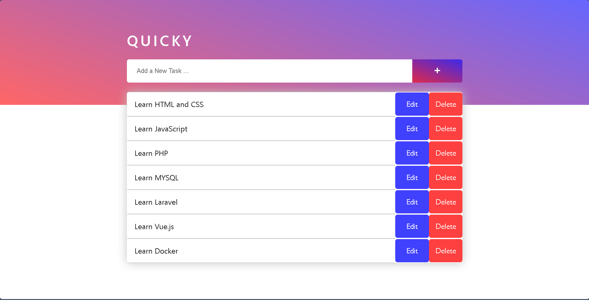
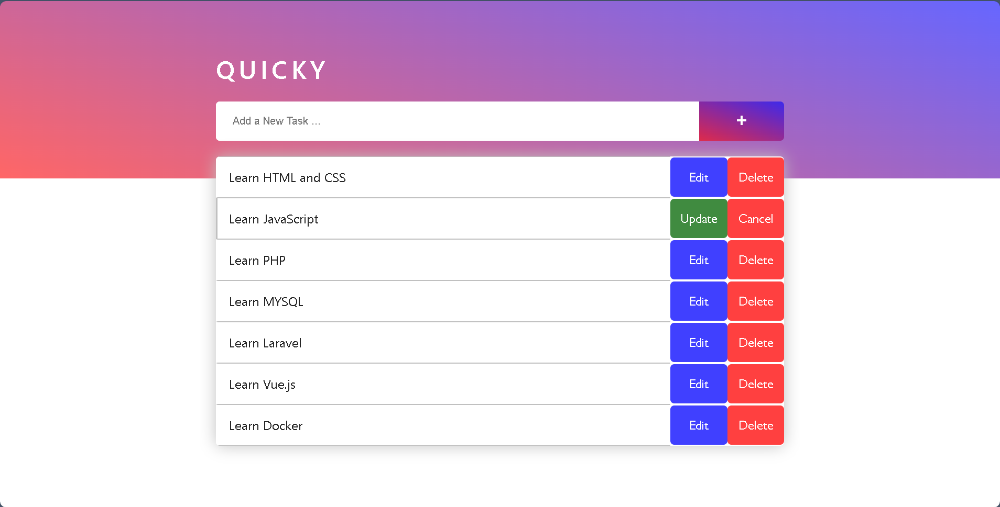

# Simple ToDo List: Quicky

[](LICENSE)

A simple ToDo List application named "Quicky," allowing users to create, read, edit, delete, and update tasks. Built with HTML, CSS, JavaScript, and PHP. Utilizes asynchronous JavaScript for seamless interactions with the server.

## Table of Contents
- [Overview](#overview)
- [Features](#features)
- [Preview](#preview)
- [Getting Started](#getting-started)
- [Usage](#usage)
- [Contributing](#contributing)
- [License](#license)
- [Contact](#contact)

## Overview
"Quicky" is a straightforward ToDo List application designed for simplicity and efficiency. Users can perform basic tasks such as creating, reading, editing, deleting, and updating tasks. The application employs asynchronous JavaScript to handle interactions with the PHP backend, ensuring a smooth user experience.

## Features
- **Task Operations:** Create, read, edit, delete, and update tasks with ease.
- **Asynchronous Interaction:** JavaScript handles interactions with PHP for seamless user experiences.
- **User-Friendly Interface:** Simple and intuitive design for efficient task management.
- **Responsive Design:** Seamlessly adapts to various devices, ensuring an optimal viewing experience for all users.

## Preview



For a closer look, check out the [live demo](http://quicky.infinityfreeapp.com/) or clone the repository and open the `index.html` file in your web browser.

## Getting Started
1. Clone the repository
   ```bash
   git clone https://github.com/Okafor-Chiagozie/Quicky.git
   ```

2. Set up the database
   - Create a new database (e.g. "quicky")
   - Import the SQL file ([quicky.sql](quicky.sql)) to set up the schema
   - Update database configuration in [config.php](scripts/config.php)

3. Run the application
   - Use a local development server (eg. [XAMPP](https://www.apachefriends.org/download.html)) or configure your web server to serve the PHP files.
   
## Usage
To use "Quicky," follow these simple steps:

1. Open the `index.html` file in your preferred web browser.

2. **View Tasks:**
   - Upon loading the application, existing tasks will be displayed.
  
3. **Create a New Task:**
   - Enter the task details in the first input section having the "Add a new task" placeholder.
   - Click on the "Add Task" button beside the input section.

4. **Update a Task:**
   - Go to the task you want to update.
   - Click the corresponding "Edit" button.
   - The container of the task changes to an input section.
   - Modify the task details and click the corresponding "Update" button.

5. **Delete a Task:**
   - Go to the task you want to delete.
   - Click the corresponding "Delete" button to remove the task.

8. **Asynchronous Updates:**
   - Notice that interactions with tasks are handled seamlessly with the server using asynchronous JavaScript.

## Contributing
- Fork the repository
- Create a new branch 
   ```bash
   git checkout -b feature/your-feature
   ```
- Make changes and commit 
   ```bash
   git commit -m 'Add some feature'
   ```
- Push to the branch 
   ```bash
   git push origin feature/your-feature
   ```
- Open a pull request

## License
This project is licensed under the MIT License - see the [LICENSE](LICENSE) file for details.

## Contact
Feel free to contact me at [ collincity111@gmail.com ] for any inquiries or feedback.


